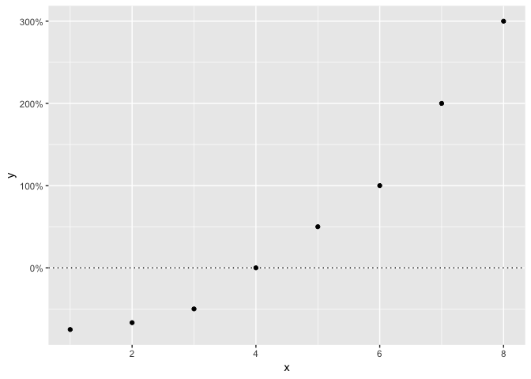
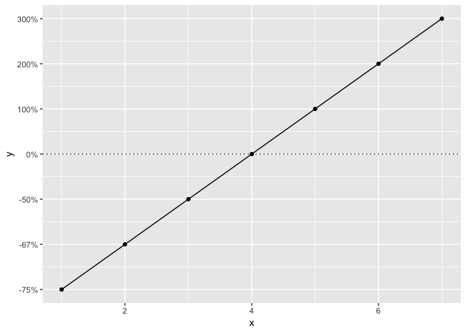

<!-- README.md is generated from README.Rmd. Please edit that file -->

<!-- badges: start -->

[](https://travis-ci.org/poissonconsulting/poisplot)
[](https://ci.appveyor.com/project/poissonconsulting/poisplot)
[](https://codecov.io/gh/poissonconsulting/poisplot?branch=master)
[](https://opensource.org/licenses/MIT)
<!-- badges: end -->

# poisplot

`poisplot` is an R package of a few utility functions to help with
creating ggplot objects for Poisson’s projects.

## Demonstration

People often find it easiest to conceptualize an effect size in terms of
the percent change. However, negative percent change (which cannot be
less than 100%) does not scale linearly in the same way as positive
percent change (which is unlimited). This results in positive changes
appearing much larger than equivalent negative changes in a standard
plot.

``` r
library(poisplot)
library(ggplot2)
library(scales)

data <- data.frame(y = c(-3/4,-2/3,-1/2,0,1,2,3))
data$x <- 1:nrow(data)

gp <- ggplot(data, aes(x = x, y = y)) +
  geom_hline(yintercept = 0, linetype = "dotted") +
  geom_line() +
  geom_point()

gp + scale_y_continuous(labels = percent)
```

<!-- -->

The `nfold_trans()` function ensures that negative percent changes scale
in the same way as positive percent
changes.

``` r
gp + scale_y_continuous(labels = percent, trans = nfold_trans(), breaks = data$y)
```

<!-- -->

The poisplot also makes the Poisson plot theme available.

``` r
gp + scale_y_nfold(labels = percent) +
  theme_Poisson()
```

<!-- -->

## Installation

To install the latest development version from
[GitHub](https://github.com/poissonconsulting/poisplot)

    if(!"devtools" %in% installed.packages()[,1]) 
      install.packages("devtools")
    devtools::install_github("poissonconsulting/poisplot")

To install the latest development version from the Poisson drat
[repository](https://github.com/poissonconsulting/drat)

    if(!"drat" %in% installed.packages()[,1]) 
      install.packages("drat")
    drat::addRepo("poissonconsulting")
    install.packages("poisplot")

## Contribution

Please report any
[issues](https://github.com/poissonconsulting/poisplot/issues).

[Pull requests](https://github.com/poissonconsulting/poisplot/pulls) are
always welcome.

Please note that the ‘poisplot’ project is released with a [Contributor
Code of Conduct](CODE_OF_CONDUCT.md). By contributing to this project,
you agree to abide by its terms.
