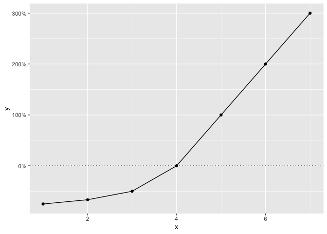
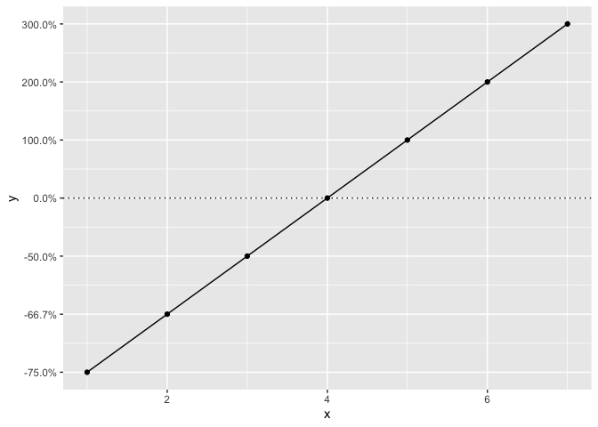
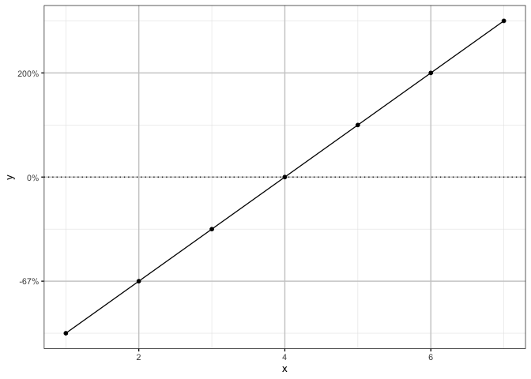

# poisplot

`poisplot` is an R package of a few utility functions to help with
creating ggplot objects for Poisson’s projects.

## Demonstration

People often find it easiest to conceptualize an effect size in terms of
the percent change. However, negative percent change (which cannot be
less than 100%) does not scale linearly in the same way as positive
percent change (which is unlimited). This results in positive changes
appearing much larger than equivalent negative changes in a standard
plot.

``` R
library(poisplot)
library(ggplot2)
library(scales)

data <- data.frame(y = c(-3 / 4, -2 / 3, -1 / 2, 0, 1, 2, 3))
data$x <- 1:nrow(data)

gp <- ggplot(data, aes(x = x, y = y)) +
  geom_hline(yintercept = 0, linetype = "dotted") +
  geom_line() +
  geom_point()

gp + scale_y_continuous(labels = percent)
```



The
[`nfold_trans()`](https://poissonconsulting.github.io/poisplot/reference/nfold_trans.md)
function ensures that negative percent changes scale in the same way as
positive percent changes.

``` R
gp + scale_y_continuous(labels = percent, transform = nfold_trans(), breaks = data$y)
```



The poisplot also makes the Poisson plot theme available.

``` R
gp + scale_y_nfold(labels = percent) +
  theme_Poisson()
```



## Installation

To install from GitHub

``` R
install.packages("devtools")
devtools::install_github("poissonconsulting/poisplot")
```

## Contribution

Please report any
[issues](https://github.com/poissonconsulting/poisplot/issues).

[Pull requests](https://github.com/poissonconsulting/poisplot/pulls) are
always welcome.

## Code of Conduct

Please note that the poisplot project is released with a [Contributor
Code of
Conduct](https://contributor-covenant.org/version/2/0/CODE_OF_CONDUCT.html).
By contributing to this project, you agree to abide by its terms.
